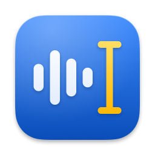

<p align="center">
  
</p>

<h1 align="center">Live Transcribe</h1>

<p align="center">
  <strong>Talk the way you talk. Get the sentence you meant, typed at your cursor in almost any
  app, and not a word leaves your Mac.</strong>
</p>

Hold **fn (🌐)**, speak, and let go. Live Transcribe turns what you said into clean, punctuated
text and types it where you are working: a message, an email, a document, a terminal. The "um"s
are gone. "Monday, no wait, Tuesday" comes out as "Tuesday". Add your names and jargon once, and
they are spelled your way.

Speech-to-text and a small language model run on your Apple silicon Mac with
[MLX](https://github.com/ml-explore/mlx-swift). There is no account, no cloud and no telemetry,
and once the models are downloaded it works offline. When you would rather watch than type, a
live transcript window shows your words as you speak and tidies each line in place.

Free and open source (MIT) · Apple silicon · macOS 14 or later (tested on macOS 27) · English ·
[build from source](#build-and-run)

## See the difference

Real outputs from the dictation eval, at the default **Medium** cleanup level:

| You say | Live Transcribe types |
|---|---|
| Um, I think we should, uh, push the launch by a week | I think we should push the launch by a week. |
| Let's meet on Monday, no wait, Tuesday | Let's meet on Tuesday. |
| The budget is fifty thousand, I mean sixty thousand | The budget is 60,000. |
| We're flying into Boston, scratch that, into New York | We're flying into New York. |
| Tell Daniel, sorry, tell Maria the draft is ready | Tell Maria the draft is ready. |
| So, uh, what time does the, um, the train leave | So, what time does the train leave? |
| I'll be about ten minutes late, the train is running slow today | I'll be about 10 minutes late. The train is running slow today. |
| hi emoji fireworks | Hi 🎆. |
| email me at john dot smith at example dot com | Email me at john.smith@example.com. |

And in anything that takes several lines, such as a document, an email or a chat message:

| You say | Live Transcribe types |
|---|---|
| Things to do today. First, call the bank. Second, book the flights. Third, send the invoice. | Things to do today:<br>1. Call the bank<br>2. Book the flights<br>3. Send the invoice |
| hi John thanks for the update I will review it tomorrow cheers Sam | Hi John,<br><br>Thanks for the update, I will review it tomorrow.<br><br>Cheers,<br>Sam |

**12 of 12 self-corrections resolved. 10 of 10 filler clips cleaned. 65 of 65 clips laid out as
meant. 428 ms at p95.** In the 65-clip dictation eval at Medium, dictating into a multi-line
field, speech-to-text plus cleanup of sentence-length dictations took 186 ms at p50 and 428 ms at
p95, well inside the 1.2 s target.

Measured on an M4 Pro with synthetic speech: the left column is the script a macOS text-to-speech
voice read aloud. Stopping the recorder and inserting the text are not included in those times.
Three of the 65 clips fell back to the uncleaned transcript: a plain sentence and two spoken
lists, which were still laid out ([details](docs/development.md#dictation-eval)).

## Features

- **Say it naturally, get what you meant.** At the default **Medium** level, fillers disappear,
  spoken self-corrections are resolved and spoken lists and letters are laid out; say emoji,
  punctuation and line breaks at any level. Every edit is checked against what you said, and
  ⌃⌥Z puts your own words back.
- **Dictate from any app.** Hold **fn (🌐)** or a shortcut of your own, or double-tap it for
  hands-free. A small panel by your cursor shows what is happening, and Esc cancels.
- **Make it yours.** Snippets insert saved text when you say their phrase, and vocabulary spells
  your names and jargon your way. Choose how much it edits: **None**, **Light**, **Medium** or
  **High**.
- **Dependable, app after app.** Text goes in through Accessibility and is read back, or is
  pasted with your clipboard put back, so terminals, browsers and Electron apps work too. Line
  breaks go only where they belong, and nothing goes into a password field.
- **Private by design.** Speech-to-text and cleanup run on your Mac, with no account, no cloud
  and no telemetry. Dictation history stays on this Mac, and you can turn it off.
- **A live transcript, too.** Watch your words appear as you speak, each line cleaned in place
  and every session saved.
- **Easy to start, easy to trust.** Guided setup, VoiceOver support, more than 1,000 tests, a
  bench for your own recordings, a tool that retrains the adapter on your Mac, and your own
  models if you prefer.

Every feature, in detail: [docs/features.md](docs/features.md).

## Documentation

| Guide | What's in it |
|---|---|
| [Features](docs/features.md) | Everything Live Transcribe does, in detail, and what's coming next |
| [Using Live Transcribe](docs/using.md) | First launch, dictating, Dictation History, the live transcript, microphones, updates and every Settings tab |
| [Cleanup and spoken commands](docs/cleanup.md) | The four cleanup levels, what OutputGuard rejects, and the phrases that become emoji, punctuation, line breaks and addresses |
| [Snippets, vocabulary and apps](docs/snippets-vocabulary-apps.md) | Saved text, your names and jargon, and how each app gets its text and line breaks |
| [Privacy](docs/privacy.md) | What is kept where, what goes over the network, and how to remove it all |
| [Signing and Gatekeeper](docs/signing.md) | Ad-hoc signing, keeping permissions across rebuilds, and distributing a build |
| [Known limitations](docs/limitations.md) | What doesn't work well yet |
| [Development](docs/development.md) | The tests and their audio clips, the bench and the dictation eval, training the adapter, the licence notices, and the icons |
| [Design notes](docs/design-notes.md) | Why it is built the way it is |
| [Dictation design](docs/dictation.md) | Dictation's decisions, assumptions, architecture, settings and eval results |
| [Training the adapter](Packages/LiveTranscribeKit/Training/README.md) | The self-correction adapter's dataset, training and evaluation |

## Status

A working proof of concept, free and open source under the [MIT License](LICENSE).

- There are no prebuilt downloads: build it from source (below).
- Tested on an M4 Pro Mac with macOS 27 and Xcode 27. The app targets macOS 14 or later but has
  not been run on older systems.
- Tested with English speech. Parakeet v3 also recognises other European languages, but the
  cleanup step has not been tested with them.
- Issues and pull requests are welcome.
- What doesn't work well yet is in [Known limitations](docs/limitations.md).

## Requirements

- An Apple silicon Mac. With the default models the app uses about 3 GB of memory. It has not
  been tested on 8 GB Macs.
- To build: Xcode 26.4 or later (Swift 6.3 or later), with its Metal Toolchain component
  (`xcodebuild -downloadComponent MetalToolchain`). MLX compiles Metal shaders, so build with
  `xcodebuild` or Xcode; `swift build` produces binaries without the Metal library.
- Disk space: about 3.5 GB for the models (Parakeet TDT 0.6B v3 is 2.5 GB, Qwen3-1.7B-4bit about
  1 GB) and about 2 GB for the build. The tests and the bench need roughly 7 GB more: their own
  copy of the models and their own build.

## Build and run

From the repository root:

```bash
xcodebuild build -project LiveTranscribe.xcodeproj -scheme LiveTranscribe -configuration Release -destination 'platform=macOS,arch=arm64' -derivedDataPath .build/xcode-app -skipPackagePluginValidation
```

```bash
open .build/xcode-app/Build/Products/Release/LiveTranscribe.app
```

Or open `LiveTranscribe.xcodeproj` in Xcode and choose Run. The shared scheme runs the
**Release** configuration, because MLX inference in Debug is several times slower. On the first
build Xcode asks you to trust mlx-swift's `CudaBuild` build-tool plugin, which only does work in
CUDA builds; `-skipPackagePluginValidation` skips that prompt on the command line.

Live Transcribe runs in the menu bar. On first launch, **Set Up Dictation** walks you through
microphone access, Accessibility and the fn key while the models (about 3.5 GB) download; see
[First launch](docs/using.md#first-launch).

**macOS treats every ad-hoc build as a new app.** After a rebuild it asks for microphone access
again, and the shortcut does not work until you remove the old Live Transcribe entry in Privacy
& Security › Accessibility and add the new build. To keep the permissions across rebuilds, sign
with your own certificate: copy `Config/Signing.local.xcconfig.example` to
`Config/Signing.local.xcconfig` (gitignored) and set your team ID. More in
[Signing and Gatekeeper](docs/signing.md).

### Tests

The package has more than 1,000 Swift Testing tests. Unit tests need no models:

```bash
(cd Packages/LiveTranscribeKit && xcodebuild test -scheme LiveTranscribeKit-Package -destination 'platform=macOS,arch=arm64' -derivedDataPath .build/xcode -skipPackagePluginValidation -skip-testing:IntegrationTests)
```

The end-to-end tests, the bench and the dictation eval need generated audio clips and the
models; see [Development](docs/development.md).

## Privacy

Audio and transcripts never leave your Mac, and there is no telemetry. The app goes online only
to download the models from Hugging Face and, in a downloaded release, to check GitHub for a new
version about once a day if you allow it. **Dictation history is on by default:** every
completed dictation (what you said, what was typed, the app and timings) is kept unencrypted on
this Mac, never synced, until you turn history off, limit how long it is kept or clear it in
**Settings › History**. Where each file lives, and how to remove everything:
[docs/privacy.md](docs/privacy.md).

## Architecture

- **Two pipelines, one set of models.** The live transcript runs microphone → Silero voice
  activity detection → Parakeet speech-to-text → Qwen3-1.7B cleanup at the chosen level → window
  and JSONL file. Dictation runs shortcut → recording → Parakeet → placeholders for snippets,
  spoken commands and list markers, and vocabulary → filler rule, letter frame and Qwen3-1.7B
  cleanup, checked by OutputGuard → line breaks and layout → snippets, emoji and addresses
  restored → text at the cursor. One Parakeet and one Qwen3-1.7B instance serve both.
- **A menu bar app.** Dictation has to be available in every app, so Live Transcribe lives in
  the menu bar (`LSUIElement`) and becomes a regular app with a Dock icon only while one of its
  windows (transcript, history, Settings, setup) is open.

```
App/                          menu bar app: menu, windows, composition root, app icon
LiveTranscribe.xcodeproj      app project (ad-hoc signed, hardened runtime, no App Sandbox)
design/                       the app icon, drawn as SVG
docs/                         the guides indexed above, design notes and dictation's design
scripts/                      test audio (generate-*-audio.sh) and icons (render-icons.sh)
site/                         the website, published to GitHub Pages
Packages/LiveTranscribeKit/   all feature code, as vertical slices
  Sources/
    Shared/          value types, AppSettings, logging, deadline, edit distance, atomic file writes
    Capture/         AVCaptureSession microphone capture → 16 kHz mono; microphone list and choice
    Segmentation/    Silero VAD + segmentation state machine (pre-roll, hysteresis, max length)
    Transcription/   Parakeet via mlx-audio-swift
    Cleanup/         Qwen3 via mlx-swift-lm, prompt, OutputGuard fallbacks, fine-tuned adapter
    Persistence/     JSONL session files and dictation history
    Session/         SessionCoordinator (lifecycle) + SessionPipeline (3 concurrent stages)
    TranscriptUI/    live transcript view model and views
    Hotkey/          global shortcut monitor (event tap), hold/double-tap gestures, bindings
    Permissions/     Accessibility and microphone permission, System Settings links
    Insertion/       typing at the cursor: Accessibility, paste with clipboard restore, per-app settings
    Styles/          rule-based filler removal and layout: lists and letters
    SpokenCommands/  emoji, punctuation, line breaks and addresses said aloud
    Snippets/        trigger phrases and the text they insert
    Vocabulary/      names and jargon, with how they are spoken
    Dictation/       DictationController: hotkey → record → transcribe → clean up → insert
    DictationUI/     menu bar menu, floating panel, setup, Settings tabs, history window
    MLXSupport/      MLX runtime configuration (GPU cache limit)
    Bench/           command-line tool: WER and latency over test clips, live transcript or dictation
    CleanupTraining/ dataset, LoRA training and evaluation for the cleanup adapter
    Train/           command-line tool: generate, validate, train and evaluate the adapter
  Tests/             Swift Testing; tests that need the models run only when enabled
  Training/          the adapter's dataset, and how it is trained (Training/README.md)
```

`App/AppComposition.swift` is the app's composition root: it constructs every concrete slice
implementation (the bench and the tests wire their own). The Settings window is the exception: it
reads and writes the settings in UserDefaults directly. Everything else depends on protocols
(`AudioSource`, `SpeechSegmenter`, `Transcriber`, `Cleaner`, `SessionSink`,
`MicrophonePermissionProviding`, for dictation `HotkeyMonitor`, `FocusedTargetProvider`,
`TextDelivery`, `DictationHistory` and `AccessibilityPermissionProviding`, and in the UI
`SessionControlling` and `InputDeviceSelecting`), which the unit tests replace with fakes or, for
`SessionSink`, the in-memory `MemorySessionSink`. Dictation and the live transcript share one
instance of each model; they never run at the same time.

Why it is built this way: [Design notes](docs/design-notes.md) and
[Dictation design](docs/dictation.md).

## Models and credits

The app downloads the models from Hugging Face. They are not part of this repository and not
covered by its licence. The cleanup adapter, a 10 MB LoRA adapter for Qwen3-1.7B, is part of
this repository.

| Role | Model used | Original model | Licence |
|---|---|---|---|
| Speech-to-text | [mlx-community/parakeet-tdt-0.6b-v3](https://huggingface.co/mlx-community/parakeet-tdt-0.6b-v3) | [Parakeet TDT 0.6B v3](https://huggingface.co/nvidia/parakeet-tdt-0.6b-v3) by NVIDIA | [CC BY 4.0](https://creativecommons.org/licenses/by/4.0/) |
| Cleanup | [mlx-community/Qwen3-1.7B-4bit](https://huggingface.co/mlx-community/Qwen3-1.7B-4bit) | [Qwen3-1.7B](https://huggingface.co/Qwen/Qwen3-1.7B) by the Qwen team, Alibaba Cloud | Apache-2.0 |
| Self-correction adapter | bundled (`Sources/Cleanup/Adapter`) | trained on synthetic data in this repository ([`Training/`](Packages/LiveTranscribeKit/Training/README.md)) | MIT |
| Voice activity detection | [mlx-community/silero-vad](https://huggingface.co/mlx-community/silero-vad) | [Silero VAD](https://github.com/snakers4/silero-vad) by the Silero team | MIT |

If you redistribute the Parakeet weights, for example bundled with a build, CC BY 4.0 requires
you to credit NVIDIA.

Other models can be tried in **Settings › Advanced** (a Hugging Face repository ID for each role;
it is downloaded on the next launch). They must be models mlx-audio-swift or mlx-swift-lm can
load, and the self-correction adapter is used only with mlx-community/Qwen3-1.7B-4bit.

Built with [mlx-swift](https://github.com/ml-explore/mlx-swift),
[mlx-swift-lm](https://github.com/ml-explore/mlx-swift-lm),
[mlx-audio-swift](https://github.com/Blaizzy/mlx-audio-swift),
[swift-huggingface](https://github.com/huggingface/swift-huggingface) and
[swift-transformers](https://github.com/huggingface/swift-transformers). Every package
dependency, including indirect ones, is MIT or Apache-2.0 licensed. Some bundle third-party code
under other permissive licences (MLX includes the BSD-licensed PocketFFT, for example), so a
redistributed build must carry those notices too. The app does: **About Live Transcribe** in the
menu bar shows every package's licence, collected from `Package.resolved` by
`scripts/generate-acknowledgements.sh`.

## License

[MIT](LICENSE) [© 2026 Nerdstorm](https://nerdstorm.com.au). The licence covers this repository's
code only. The models (see [Models and credits](#models-and-credits)) and the Swift package
dependencies have their own licences.
