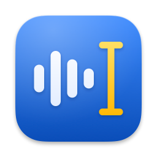
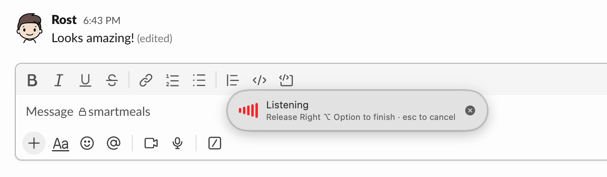

<p align="center">
  
</p>

<h1 align="center">Live Transcribe</h1>

<p align="center">
  <strong>Talk the way you talk. Get the sentence you meant, typed at your cursor in almost any
  app, and not a word leaves your computer.</strong>
</p>

Hold a key (**fn (🌐)** on a Mac, **Right Ctrl** on Linux and Windows), speak, and let go. Live
Transcribe turns what you said into clean, punctuated text and types it where you are working: a
message, an email, a document, a terminal. The "um"s are gone. "Monday, no wait, Tuesday" comes
out as "Tuesday". On the Mac, add your names and jargon once, and they are spelled your way.

Speech-to-text and a small language model run on your computer, with
[MLX](https://github.com/ml-explore/mlx-swift) on an Apple silicon Mac and with
[OpenVINO](https://github.com/openvinotoolkit/openvino) and
[sherpa-onnx](https://github.com/k2-fsa/sherpa-onnx) on Linux and Windows. There is no
account, no cloud and no telemetry, and once the models are downloaded it works offline. On the
Mac, a live transcript window shows your words as you speak and tidies each line in place.

Free and open source (MIT) · Mac, Linux and Windows · [31 languages](#languages) ·
[Download](https://github.com/Nerdstorm/LiveTranscribe/releases/latest) or
[build from source](#build-and-run)

## Download

| | Get | Notes |
|---|---|---|
| **Mac** | `LiveTranscribe.dmg`, signed with Developer ID and notarized. It keeps itself up to date. | Apple silicon, macOS 14 or later. Everything below. |
| **Linux** | a `.deb`, an `.rpm` or an `.AppImage` | x86-64, glibc 2.35 or later, on a Wayland desktop that allows typing: COSMIC works; GNOME, KDE Plasma and X11 don't yet. Hold-to-talk needs a udev rule to read the keyboard: the deb and rpm install it, and the AppImage needs it added by hand. |
| **Windows** | `live-transcribe_X.Y.Z_x64-setup.exe`, not signed yet, so SmartScreen warns (More info, then Run anyway) | Windows 10 or 11, x86-64. |

Linux and Windows have dictation, the tray and Settings; the live transcript, dictation history,
Undo AI Edit, snippets, vocabulary and per-app settings are Mac-only for now. The install
commands are in each release's notes; first start and every setting are in
[Using Live Transcribe](docs/using.md).

## See the difference

A reply dictated into Slack on the Mac: hold the shortcut, speak, let go. (Recorded with an
earlier version, when the panel was a capsule at the text cursor; it is now a small circle by the
mouse pointer.)

<p align="center">
  
</p>

Real outputs from the dictation eval, at the default **Medium** cleanup level:

| You say | Live Transcribe types |
|---|---|
| Um, I think we should, uh, push the launch by a week | I think we should push the launch by a week. |
| Let's meet on Monday, no wait, Tuesday | Let's meet on Tuesday. |
| The budget is fifty thousand, I mean sixty thousand | The budget is sixty thousand. |
| We're flying into Boston, scratch that, into New York | We are flying into New York. |
| Tell Daniel, sorry, tell Maria the draft is ready | Tell Maria the draft is ready. |
| So, uh, what time does the, um, the train leave | So what time does the train leave? |
| I'll be about ten minutes late, the train is running slow today | I'll be about 10 minutes late. The train is running slow today. |
| see you soon smiley face emoji | See you soon! 🙂 |
| email me at john dot smith at example dot com | Email me at john.smith@example.com. |

And in anything that takes several lines, such as a document, an email or a chat message:

| You say | Live Transcribe types |
|---|---|
| Things to do today. First, call the bank. Second, book the flights. Third, send the invoice. | Things to do today:<br>1. Call the bank<br>2. Book the flights<br>3. Send the invoice |
| hi John thanks for the update I will review it tomorrow cheers Sam | Hi John,<br><br>Thanks for the update. I will review it tomorrow.<br><br>Cheers,<br>Sam |

**12 of 12 self-corrections resolved. 10 of 10 filler clips cleaned. 65 of 65 clips laid out as
meant. 641 ms at p95.** In the 65-clip dictation eval at Medium, dictating into a multi-line
field, speech-to-text plus cleanup of sentence-length dictations took 280 ms at p50 and 641 ms at
p95, well inside the 1.2 s target.

Measured on an M4 Pro Mac with synthetic speech: the left column is the script a macOS
text-to-speech voice read aloud. Stopping the recorder and inserting the text are not included in
those times. Three of the 65 clips fell back to the uncleaned transcript, with fillers still
removed: a plain sentence, a sentence the speech model broke at a hesitation, and a spoken "comma"
it heard as "common" ([details](docs/development.md#bench-and-eval)). The Linux and Windows app
cleans up the same way, on the same model; it runs on the CPU there, about four times slower than
on a Mac.

## Features

- **Say it naturally, get what you meant.** At the default **Medium** level, fillers disappear,
  spoken self-corrections are resolved and spoken lists and letters are laid out; say emoji,
  punctuation and line breaks at any level. Every edit is checked against what you said, and on
  the Mac ⌃⌥Z puts your own words back.
- **Dictate from any app.** Hold the key, or double-tap it for hands-free. A small circle by the
  mouse pointer shows what is happening, and Esc cancels. On the Mac the key is **fn (🌐)** or a
  shortcut of your own; on Linux and Windows, **Right Ctrl** or one other key.
- **Choose how much it edits.** **None**, **Light**, **Medium**, **High**, or **Deep**, which
  also follows a correction back into an earlier sentence ("…is tomorrow. No, sorry, the after
  tomorrow." → "…is the day after tomorrow."), fixes grammar and lays out emails and lists.
- **Make it yours (Mac).** Snippets insert saved text when you say their phrase, and vocabulary
  spells your names and jargon your way.
- **Dependable, app after app.** On the Mac, text goes in through Accessibility and is read
  back, or is pasted with your clipboard put back, so terminals, browsers and Electron apps work
  too. Linux types through the Wayland input method, or pastes; Windows types as keystrokes. Line
  breaks go only where they belong, and nothing goes into a password field it can recognise.
- **Private by design.** Speech-to-text and cleanup run on your computer, with no account, no
  cloud and no telemetry. The Mac's dictation history stays on this Mac, and you can turn it off;
  Linux and Windows keep none.
- **A live transcript, too (Mac).** Watch your words appear as you speak, each line cleaned in
  place and every session saved.
- **Easy to start, easy to trust.** Guided setup and VoiceOver support on the Mac, more than
  1,000 tests, a bench for your own recordings, a tool that retrains the adapters on your Mac, and
  your own models if you prefer.

## Languages

Live Transcribe recognises 31 languages, and the default speech model works out which one you are
speaking. Sinhala comes out in Sinhala script with English words in English letters, as people
type it: "meeting එක cancel කරන්න".

| | | | |
|---|---|---|---|
| Arabic | Cantonese | Chinese (Mandarin) | Czech |
| Danish | Dutch | English | Filipino |
| Finnish | French | German | Greek |
| Hindi | Hungarian | Indonesian | Italian |
| Japanese | Korean | Macedonian | Malay |
| Persian | Polish | Portuguese | Romanian |
| Russian | **Sinhala** | Spanish | Swedish |
| Thai | Turkish | Vietnamese | |

Cleanup is written for English. Sinhala skips the cleanup model and is typed as recognised, and
the other languages haven't been tested with cleanup. The default speech model is Qwen3-ASR 0.6B,
[fine-tuned for Sinhala](https://github.com/Nerdstorm/LiveTranscribe-Sinhala) by Nerdstorm; the
Models tab in Settings offers others.

## Documentation

| Guide | What's in it |
|---|---|
| [Using Live Transcribe](docs/using.md) | Installing, first start, dictating and every Settings tab, on the Mac, Linux and Windows, plus the Mac's Dictation History and live transcript |
| [Cleanup and spoken commands](docs/cleanup.md) | The five cleanup levels, what OutputGuard and Deep's check reject, and the phrases that become emoji, punctuation, line breaks and addresses |
| [Snippets, vocabulary and apps](docs/snippets-vocabulary-apps.md) | Saved text, your names and jargon, and how each app gets its text and line breaks |
| [Privacy](docs/privacy.md) | What is kept where, what goes over the network, and how to remove it all |
| [Known limitations](docs/limitations.md) | What doesn't work well yet, and what isn't built |
| [Development](docs/development.md) | Building and signing, the tests and their audio clips, the bench and the dictation eval, training the adapters, licence notices and icons |
| [Linux and Windows app](linux-windows/README.md) | Building, packaging and changing the Rust app |
| [Releasing](docs/releasing.md) | The signing credentials, and writing the changelog, building, notarizing, publishing and offering a release as an update |
| [Architecture](docs/architecture.md) | For contributors: how dictation and cleanup work step by step, with diagrams, where each step's code is on the Mac and on Linux and Windows, and where to make a change |
| [Design notes](docs/design-notes.md) | Why it is built the way it is |
| [Training the adapters](Packages/LiveTranscribeKit/Training/README.md) | The self-correction and Deep adapters' datasets, training and evaluation |

## Status

Version 1.0, free and open source under the [MIT License](LICENSE).

- Download it from [GitHub Releases](https://github.com/Nerdstorm/LiveTranscribe/releases/latest),
  or build it from source (below). What changed in each release is in the
  [changelog](CHANGELOG.md).
- The Mac app was tested on an M4 Pro Mac with macOS 27 and Xcode 27. It targets macOS 14 or
  later but has not been run on older systems, nor on 8 GB Macs. With the default models it uses
  about 3 GB of memory.
- The Linux app has been run on COSMIC. GNOME, KDE Plasma and X11 desktops are not supported yet.
  The Windows app is built and tested in CI, which also installs it and starts it. On an Intel
  desktop CPU on Linux, the default speech model peaked at 5.3 GB of memory over a long test run,
  and the cleanup model at 2.5 GB.
- Tested with English and Sinhala speech. It recognises 29 other languages too; see
  [Languages](#languages).
- Issues and pull requests are welcome; see [Reporting a problem](#reporting-a-problem).
- What doesn't work well yet is in [Known limitations](docs/limitations.md).

## Reporting a problem

[Open an issue](https://github.com/Nerdstorm/LiveTranscribe/issues/new), in whatever form suits
you. These help, when you have them:

- your computer and its system (the Mac and macOS version; the Linux distribution and desktop;
  the Windows version), and the app's version (**About Live Transcribe** in the Mac's menu bar,
  `livetranscribe --version` on Linux and Windows, from a terminal);
- the app you were dictating into;
- what you said, what was typed, and what you expected;
- for a Mac crash, the report macOS offers to send, or the one in Console › Crash Reports; on
  Linux and Windows, the terminal output when it is started with `LIVETRANSCRIBE_LOG=info` set
  (on Windows, run `livetranscribe.exe` from a terminal in its install folder).

## Build and run

On the Mac you need an Apple silicon Mac and Xcode 26.4 or later with its Metal Toolchain
component (`make doctor` checks what is missing); from the repository root:

```bash
make run
```

builds the app in Release and opens it. `make` on its own lists every target: the tests, the bench
and the eval, releases, and upkeep such as the licence notices and the icons. Building for the
first time, signing your builds so the permissions survive a rebuild, and disk space: see
[Development](docs/development.md). On first launch, **Set Up Dictation** walks you through
microphone access, Accessibility and the fn key while the models (about 2 GB) download; see
[First launch](docs/using.md#first-launch).

Linux and Windows are a Cargo workspace in `linux-windows/`: run `packaging/fetch-sherpa-onnx.sh`
once, then `cargo test` (Linux also needs Tauri's build packages). Building and packaging it:
[linux-windows/README.md](linux-windows/README.md).

## Privacy

Audio and transcripts never leave your computer, and there is no telemetry. The app goes online
only to download models (from Hugging Face; on Linux and Windows also from GitHub) and, in a
downloaded Mac release, to check GitHub for a new version about once a day if you allow it.
**On the Mac, dictation history is on by default:** every completed dictation (what you said,
what was typed, the app and timings) is kept unencrypted on this Mac, never synced, until you turn
history off, limit how long it is kept or clear it in **Settings › History**. Linux and Windows
keep nothing about what you say. **On Linux, hold-to-talk needs a udev rule (installed by the deb
and rpm) that lets any program you run read the keyboard**, as any X11 program always could. Where
each file lives, and how to remove everything:
[docs/privacy.md](docs/privacy.md).

## How it is built

- **Two apps, one behaviour.** The Mac app is Swift, with MLX. The Linux and Windows app is Rust
  (a Tauri tray app), with OpenVINO and sherpa-onnx. The Mac app is the reference: its tests write
  fixtures that the Rust tests must reproduce, so the same text rules and the same cleanup checks
  run on all three systems.
- **Vertical slices.** Each feature's code lives together: on the Mac, one folder per slice of
  `Packages/LiveTranscribeKit`, and in `linux-windows/` one crate per slice with the same name.
  Slices depend on protocols, which the unit tests replace with fakes, and
  `App/AppComposition.swift` constructs every concrete implementation.
- **Menu bar and tray apps.** Dictation has to be available in every app, so Live Transcribe
  lives in the menu bar or the tray. On the Mac it becomes a regular app with a Dock icon only
  while one of its windows (transcript, history, Settings, setup) is open.

```
App/                          the Mac app: menu, windows, composition root, app icon
LiveTranscribe.xcodeproj      the Mac app's project (hardened runtime, no App Sandbox)
Packages/LiveTranscribeKit/   the Mac app's feature code, as vertical slices
linux-windows/                the Linux and Windows app, a Cargo workspace
Fixtures/                     golden and cleanup fixtures the Mac's tests write and the Rust tests replay
Config/                       signing settings
scripts/                      releases, the changelog, licence notices, test audio and icons
docs/                         the guides indexed above
design/                       the app icon, drawn as SVG
site/                         the website, published to GitHub Pages
CHANGELOG.md                  what changed in each release, written by make changelog
Makefile                      building, tests, the bench, releases and upkeep (make lists them)
```

Each step, with diagrams, and where to change what: [Architecture](docs/architecture.md). Why it
is built this way: [Design notes](docs/design-notes.md).

## Models and credits

The app downloads its models. They are not part of this repository and not covered by its
licence. The cleanup adapters, two 10 MB LoRA adapters for Qwen3-1.7B (one that resolves
self-corrections at Medium and High, and Deep's), are part of this repository.

| Role | Model used | Original model | Licence |
|---|---|---|---|
| Speech-to-text (default) | Mac: [Nerdstorm/Qwen3-ASR-0.6B-Sinhala-8bit](https://huggingface.co/Nerdstorm/Qwen3-ASR-0.6B-Sinhala-8bit). Linux, Windows: [Nerdstorm/Qwen3-ASR-0.6B-Sinhala-OpenVINO](https://huggingface.co/Nerdstorm/Qwen3-ASR-0.6B-Sinhala-OpenVINO) | [Qwen3-ASR-0.6B](https://huggingface.co/Qwen/Qwen3-ASR-0.6B) by the Qwen team, Alibaba Cloud, [fine-tuned for Sinhala](https://github.com/Nerdstorm/LiveTranscribe-Sinhala) by Nerdstorm on [OpenSLR 52](https://www.openslr.org/52/) (Google, CC BY-SA 4.0) | CC-BY-SA-4.0 |
| Cleanup | Mac: [mlx-community/Qwen3-1.7B-4bit](https://huggingface.co/mlx-community/Qwen3-1.7B-4bit). Linux, Windows: [Nerdstorm/Qwen3-1.7B-MLX-4bit-OpenVINO](https://huggingface.co/Nerdstorm/Qwen3-1.7B-MLX-4bit-OpenVINO), the same weights converted | [Qwen3-1.7B](https://huggingface.co/Qwen/Qwen3-1.7B) by the Qwen team, Alibaba Cloud | Apache-2.0 |
| Self-correction adapter | bundled (`Sources/Cleanup/Adapter`) | trained on synthetic data in this repository ([`Training/`](Packages/LiveTranscribeKit/Training/README.md)) | MIT |
| Deep adapter | bundled (`Sources/Cleanup/DeepAdapter`) | trained on synthetic data in this repository ([`Training/`](Packages/LiveTranscribeKit/Training/README.md)) | MIT |
| Voice activity detection (Mac live transcript) | [mlx-community/silero-vad](https://huggingface.co/mlx-community/silero-vad) | [Silero VAD](https://github.com/snakers4/silero-vad) by the Silero team | MIT |

**Settings › Models** offers other speech-to-text models to download and switch to, without a
restart, each credited there with its licence. The Mac offers seven: the default, Qwen3-ASR 0.6B and
1.7B, Parakeet TDT v2 (English) and v3 (European languages), Whisper large-v3-turbo and Cohere
Transcribe. Linux and Windows offer four: the default, Parakeet v2 and v3 and Cohere Transcribe; the
last three are builds that [sherpa-onnx](https://github.com/k2-fsa/sherpa-onnx) (k2-fsa, Apache-2.0)
quantised to 8 bits for ONNX. Cohere Transcribe can't tell which language it hears, so its row also
chooses which of its 14 it writes (English at first); the others find the language themselves. They
are listed in
[`speech-models.json`](Packages/LiveTranscribeKit/Sources/Transcription/Resources/speech-models.json),
each pinned to a tested commit or, for sherpa-onnx archives, a SHA-256, and both apps read that
list. **Another model** there takes, on the Mac, any Hugging Face repository that mlx-audio-swift
can load or a folder on your Mac with the files such a repository has, and on Linux and Windows a
model converted for OpenVINO in the models folder.

The cleanup and voice activity models can be changed on the Mac in **Settings › Advanced**.

The Mac app is built with [mlx-swift](https://github.com/ml-explore/mlx-swift),
[mlx-swift-lm](https://github.com/ml-explore/mlx-swift-lm),
[mlx-audio-swift](https://github.com/Blaizzy/mlx-audio-swift),
[swift-huggingface](https://github.com/huggingface/swift-huggingface),
[swift-transformers](https://github.com/huggingface/swift-transformers) and
[Sparkle](https://github.com/sparkle-project/Sparkle). Every Swift package dependency, including
indirect ones, is MIT or Apache-2.0 licensed. Some bundle third-party code under other
permissive licences (MLX includes the BSD-licensed PocketFFT, for example), so a redistributed
build must carry those notices too. The app does: **About Live Transcribe** in the menu bar shows
every package's licence, collected from `Package.resolved` by
`scripts/generate-acknowledgements.sh`. The Linux and Windows app is built with
[Tauri](https://tauri.app) and other Rust crates (see `linux-windows/Cargo.lock`), OpenVINO
(Intel), sherpa-onnx (k2-fsa, Apache-2.0) and ONNX Runtime (Microsoft, MIT); its packages carry
OpenVINO's, sherpa-onnx's and ONNX Runtime's licences.

## License

[MIT](LICENSE) [© 2026 Nerdstorm](https://nerdstorm.com.au). The licence covers this repository's
code only. The models (see [Models and credits](#models-and-credits)) and the software the apps
are built with have their own licences.
