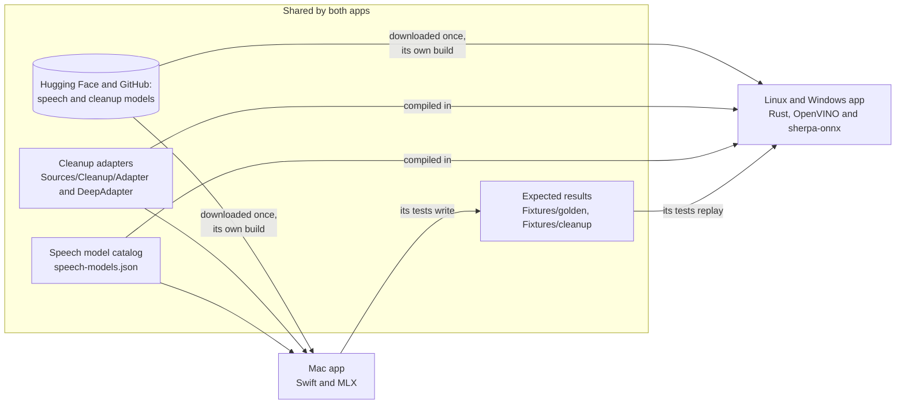
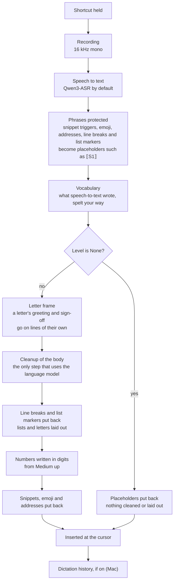
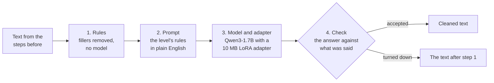
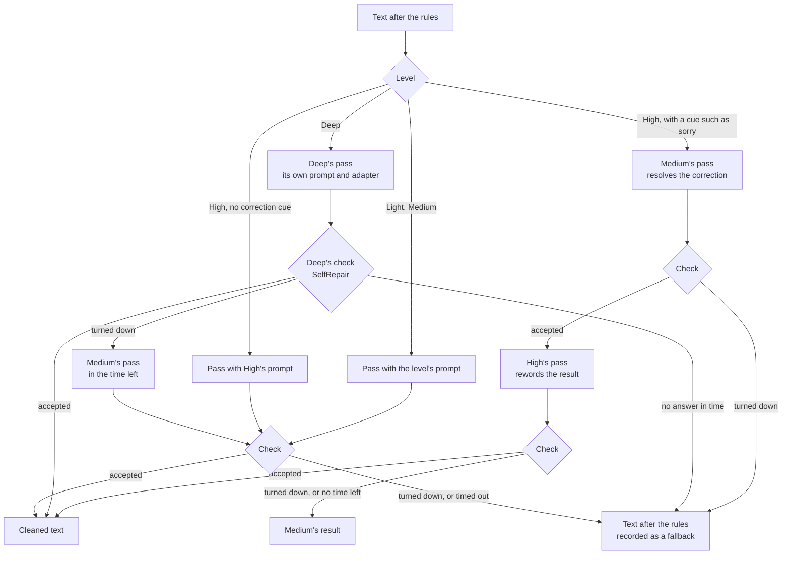
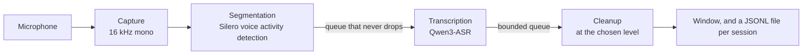
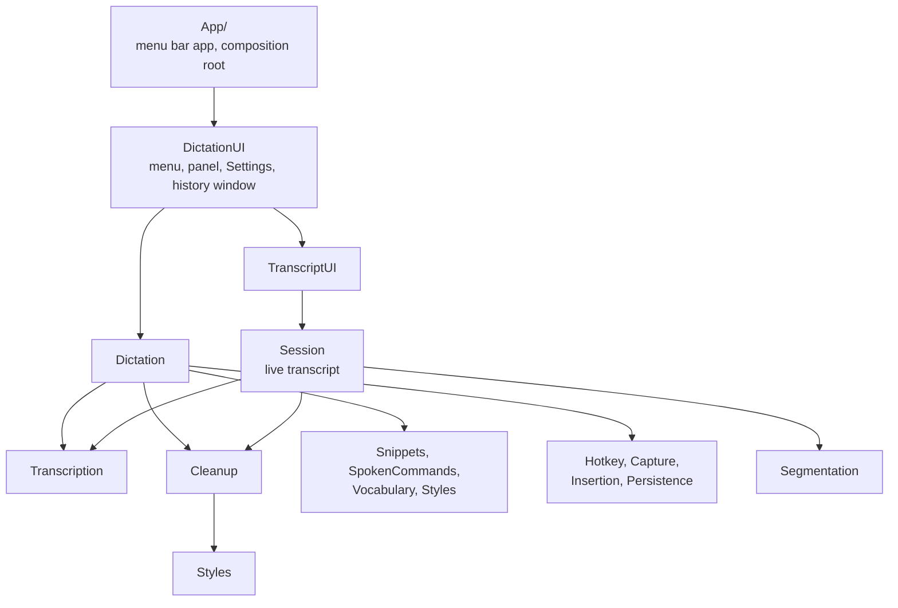
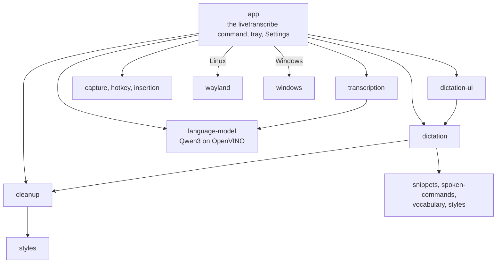
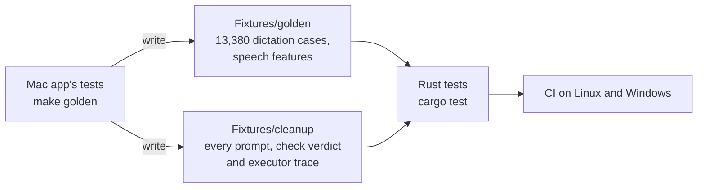
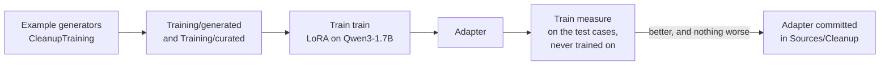

# Architecture

A map of Live Transcribe for contributors. It covers:

- what happens between the words you say and the text that appears;
- which code runs each step, on the Mac and on Linux and Windows;
- why cleanup is made of rules, a prompt, a trained adapter and a check;
- how the two apps are kept the same;
- where to make a change.

The details are in other pages:

- what each cleanup level does: [Cleanup](cleanup.md);
- why it is designed this way: [Design notes](design-notes.md);
- building, testing and measuring: [Development](development.md), and for Linux and Windows the
  [Linux and Windows README](../linux-windows/README.md).

## Two apps, one behaviour

The Mac app is written in Swift. The Linux and Windows app is written in Rust. They share their
models (converted for each runtime), their cleanup adapters, their speech model catalog and their
expected results, so the same text path types the same text, and the cleanup model answers alike in
nearly every case: 509 of the Mac's 515 Medium replies, and, run on a Mac's CPU, all of Deep's 114
hand-written cases.

| | Mac | Linux and Windows |
|---|---|---|
| Code | `App/` (the menu bar app) and `Packages/LiveTranscribeKit` (every feature, as vertical slices) | `linux-windows/`, a Cargo workspace; the app is a Tauri tray app |
| Runs the models with | MLX, on Apple silicon | OpenVINO: the Sinhala fine-tune of Qwen3-ASR on an Intel NPU or the CPU, and the cleanup model on the CPU; sherpa-onnx (CPU) for Parakeet and Cohere Transcribe |
| Does | dictation, dictation history and the live transcript | dictation, and transcribing a file from the command line |



Audio and text stay on the computer. The app goes online only to download the models, and on
the Mac to check for a new version if you allow it ([Privacy](privacy.md)).

## Dictation, step by step

You hold the shortcut, speak and let go. The text appears where you were typing.



1. **Shortcut.** Holding it records while it is held. A double tap (hands-free, on by default)
   records until the next press. A lone tap is cancelled.
2. **Speech to text.** The speech model writes what it heard, with its mistakes.
3. **Phrases protected.** Snippet triggers, emoji, addresses, and in fields that take several
   lines, line breaks and, from Medium up, spoken list markers ("number one", "bullet point") are
   replaced by placeholders such as `⟦S1⟧`. The language model can't change what a placeholder
   stands for, and its answer is turned down if a placeholder goes missing. Dictated punctuation,
   and "new line" in a one-line field, are written into the text at once, and the model may still
   adjust them.
4. **Vocabulary.** Each spoken variant you listed is rewritten to your spelling ("nerd storm" →
   "Nerdstorm"). Terms that sound like something in the dictation are also listed in the cleanup
   prompt, to be spelt as written.
5. **Letter frame.** From Medium up, in fields that take several lines, a letter's greeting and
   sign-off go on lines of their own, by rules, and only the body goes to the language model.
6. **Cleanup.** See the next section.
7. **Layout, numbers, then the rest put back.** Line breaks and list markers come back first, so
   the layout rules can lay out lists and letters. From Medium up, in every field, spoken numbers
   are then written in digits ("twenty one chairs" → "21 chairs"). This comes after the model, so
   it resolves a correction between numbers in words ("fifty thousand, I mean sixty thousand"),
   and after the list rules, so a list marker said as a word still makes a list. Then snippets,
   emoji and addresses come back, where no rule can change them.
8. **Insertion.** On the Mac, Accessibility is tried first (the text is read back to check it
   arrived), and pasting, with your clipboard restored afterwards, is the fallback; an app set to
   paste gets paste only. Linux types it through the Wayland input method, or pastes it: for now on
   COSMIC (Sway and Hyprland are untried; GNOME, KDE Plasma and X11 aren't supported yet).
   Windows types it as Unicode keystrokes. Where nothing would take the text, it is left on the
   clipboard for you to paste, except in a password field, which gets nothing.

Where each step lives:

| Step | Mac: `Packages/LiveTranscribeKit/Sources/…` | Linux and Windows: `linux-windows/crates/…` |
|---|---|---|
| The flow, one dictation at a time | `Dictation` (`DictationController`, `DictationProcessor`, `PreparedDictation`) | `dictation` |
| Shortcut and its gestures | `Hotkey` | `hotkey` |
| Recording | `Capture` | `capture` |
| Speech to text | `Transcription` | `transcription`, with `language-model` for OpenVINO |
| Placeholders | `Shared` (`PhraseProtector`), `Snippets`, `SpokenCommands`, `Styles` (list markers) | `shared`, `snippets`, `spoken-commands`, `styles` |
| Vocabulary | `Vocabulary` | `vocabulary` |
| Fillers, lists, letters and numbers | `Styles` (`FillerRemover`, `LetterFrame`, `NumberStyle`) | `styles` |
| Cleanup | `Cleanup` | `cleanup`, which runs a model behind a trait; `language-model` is the model, joined to it in `app` |
| Insertion | `Insertion` | `insertion`, `wayland` (Linux), `windows` (Windows) |
| Panel, menu, Settings | `DictationUI` | `dictation-ui`, `app` |
| History | `Persistence` | — |

## Cleanup: rules, a prompt, an adapter and a check

Cleanup has four layers. Each one does what the one before can't.



1. **Rules** (`Styles`) do what needs no judgement: fillers such as "um" go from Medium up, and
   lists, letters and numbers are written by rules around the model, as the previous section
   shows.
2. **The prompt** (`PromptBuilder`) tells the model the level's rules in plain English, with no
   worked examples. Light to High start from the same two base rules, and each level adds its
   own; Deep has its own, longer set. This is what Medium sends, with one vocabulary term:

   ```text
   Correct transcription errors, punctuation, casing and grammar in the TEXT.
   Preserve meaning, tone, hedging and filler intent exactly.
   Do not add, summarise or rephrase content.
   When the speaker corrects themselves, keep only the correction.
   If the text is already correct, return it unchanged.
   Spell these names and terms exactly as written: Nerdstorm.
   Output only the corrected text.
   ```

3. **The model and its adapter.** Qwen3-1.7B runs on the computer, with a LoRA adapter chosen per
   request: none at Light, the self-correction adapter at Medium and High, and Deep's adapter at
   Deep. An adapter is a small set of extra weights, trained on examples of exactly these rules.
   It doesn't replace the prompt: Medium's prompt above is the one its adapter was trained with.
   Without the adapters, Light and Medium are told to remove nothing and High to reword without
   removing, since the model alone can't resolve a correction reliably; Deep keeps its own prompt
   and runs on the base model (52 of 114 cases, in the table below).
4. **The check** (`OutputGuard`) compares the answer with what was said. The answer may not drop a
   negation or a word that carries meaning, move a name, damage a placeholder, or come out much
   longer, shorter or more different than the level allows. It may drop a correction cue ("sorry",
   "I mean") only together with the words the cue takes back. Deep's check (`SelfRepair`) lines up
   the words said with the words written, and every difference must be a repair Deep may make. An
   answer that fails is never shown: the text after step 1 is inserted instead (at High Medium's
   result, at Deep Medium's pass, as below), and dictation history records why.

The model is skipped, and the level's rules alone apply, when cleanup with the language model is
off in Settings, when any Sinhala character is in the text (a script the model can't copy), and
when no words remain after the rules. Level None cleans nothing at all.

Each level runs one or more passes of the model:



All passes of one dictation share one deadline: 3 s by default, and at least 8 s at Deep. The code
is `CleanupExecutor` and `DeepCleanup` on the Mac, and the same names in the `cleanup` crate.

### Why an adapter, and not only the prompt?

The rules are in the prompt, and every request sends them. What the adapter adds is a model that
follows them. Qwen3-1.7B is small enough to answer in about a quarter of a second on a Mac
(about four times as long on a Linux or Windows CPU), but on its own it reads the rules and
follows them loosely. These are the measurements
behind that choice:

| What was tried | Result |
|---|---|
| Prompting Qwen3-1.7B to resolve self-corrections ("cars, sorry, buses" → "buses") | at most 1 of 7 in an early test |
| The same with Qwen3-4B, a model more than twice the size | at most 2 of 7, 2 to 2.5 times slower, and one changed meaning |
| Qwen3-1.7B with the self-correction adapter | 97% of held-out self-corrections resolved and 98% of plain sentences kept, 0.23 s at p95 |
| Deep's prompt, no adapter | 52 of 114 hand-written cases right: the model copied every correction |
| Deep's prompt, with the model reasoning first ("thinking") | 58 of 114, taking 20 times as long |
| Deep's prompt, with the self-correction adapter | 88 of 114 |
| Deep's prompt, with an adapter trained on it | 108 of 114, 0.23 s at p50 |

[Design notes](design-notes.md#how-deep-was-chosen) has the full comparison for Deep. Large hosted
models follow a prompt of rules well, but Live Transcribe runs on your computer and works offline,
so the model has to be small. The adapter teaches the small model to follow the prompt. It is 10 MB,
it is swapped in per request, and it adds no measurable time.

This has a cost, and contributors should know it. **The model does what its training showed it.
A new rule in the prompt alone rarely changes what it does.** For example, Deep's prompt asks
for a letter's paragraphs, but its training never showed a letter's body on its own, so it
doesn't split one ([Limitations](limitations.md)). To change what the model does:

1. add examples to the training data;
2. retrain the adapter;
3. measure before and after;
4. change the check if it would turn the new answers down.

The check is what makes this safe. Whatever the model writes, a changed meaning is not inserted.

## The live transcript (Mac)

The live transcript window writes down speech continuously, in three loops that run at the same
time (`Session/SessionPipeline`):



A raw transcript is never lost. The transcription queue has no limit, and when the cleanup queue
is full, the oldest waiting segment is saved with its raw text instead of being cleaned.
Dictation and the live transcript share one instance of each model. Dictation refuses to start
while the live transcript is listening; the transcript can still be started during a dictation,
and the model actors take turns.

## Code map

### Mac

Every feature is a slice in `Packages/LiveTranscribeKit/Sources`, and `App/AppComposition.swift`
builds the concrete ones. Slices depend on protocols (`Transcriber`, `Cleaner`, `TextDelivery`,
…), which the tests replace with fakes. The main dependencies (every slice also uses `Shared`):



| Slice | What it holds |
|---|---|
| `Shared` | Value types, `AppSettings`, logging, deadlines, edit distance, atomic file writes, `CleanupLevel`, the placeholder format and the phrase protector |
| `Capture` | Microphone capture as 16 kHz mono; the microphone list and choice |
| `Segmentation` | Silero voice activity detection and the segmentation state machine |
| `Transcription` | Qwen3-ASR and the other speech models via mlx-audio-swift, by kind; the speech model catalog |
| `Cleanup` | Qwen3 via mlx-swift-lm: the prompt, `OutputGuard`, Deep's `SelfRepair`, the executor, the adapters |
| `Persistence` | JSONL session files and dictation history |
| `Session` | `SessionCoordinator` (lifecycle) and `SessionPipeline` (three concurrent stages) |
| `TranscriptUI` | The live transcript's view model and views |
| `Hotkey` | The global shortcut monitor (event tap), hold and double-tap gestures, bindings |
| `Permissions` | Accessibility and microphone permission, System Settings links |
| `Insertion` | Typing at the cursor: Accessibility, paste with clipboard restore, per-app settings |
| `Styles` | Rule-based filler removal, layout (lists and letters) and numbers in digits |
| `SpokenCommands` | Emoji, punctuation, line breaks and addresses said aloud |
| `Snippets` | Trigger phrases and the text they insert |
| `Vocabulary` | Names and jargon, with how they are spoken |
| `Dictation` | `DictationController`: hotkey, record, transcribe, clean up, insert |
| `DictationUI` | The menu bar menu, the panel, setup, the Settings tabs, the history window |
| `MLXSupport` | MLX runtime configuration (the GPU cache limit) |
| `Updates` | Sparkle updates (`SoftwareUpdating`, `SparkleUpdater`, `UpdateFeed`) |
| `About` | The licence notices (`Acknowledgements.json`) |
| `Bench` | Command-line tool: word error rate and latency over test clips, for the live transcript or dictation |
| `CleanupTraining` | The adapters' dataset, LoRA training and evaluation |
| `Train` | Command-line tool: generate, validate, train, evaluate and measure the adapters |

The protocols include `AudioSource`, `SpeechSegmenter`, `Transcriber`, `Cleaner`, `SessionSink`,
`MicrophonePermissionProviding`, for dictation `HotkeyMonitor`, `FocusedTargetProvider`,
`TextDelivery`, `DictationHistory` and `AccessibilityPermissionProviding`, and in the UI
`SessionControlling` and `InputDeviceSelecting`. The Settings window is the exception: it reads
and writes the settings in UserDefaults directly.

### Linux and Windows

The crates in `linux-windows/crates` mirror the Mac's slices. The main dependencies:



`shared` holds what the text and speech crates use, including string handling that matches Swift's
exactly, so that text is compared, cased and split the same way as on the Mac. The
[Linux and Windows README](../linux-windows/README.md) describes each crate.

## Keeping the two apps the same

The Mac app is the reference. Its tests write the expected results, and the Rust tests must
reproduce them:



To change a behaviour:

1. change the Swift;
2. run `make golden` at the repository root to write the fixtures again;
3. port the change to the crate until `cargo test` passes in `linux-windows/`.

CI runs the Rust tests on Linux and Windows whenever `linux-windows/` or the fixtures change.

## Measuring and training

A cleanup change is measured before it ships:



- `Train measure` cleans a data set through the app's own cleanup at one level. It counts the
  answers that were right, fell back, stayed unchanged, changed the meaning or were otherwise
  different, and reports latency.
- `make bench` and `make eval` measure word error rate and latency on spoken clips, for the live
  transcript and for dictation.
- The training data is generated from templates, plus examples written by hand
  (`Training/curated`). No one's dictations are in it.

[Development](development.md) and
[Training/README.md](../Packages/LiveTranscribeKit/Training/README.md) have the commands.

## Where to change what

| To… | Change | Then |
|---|---|---|
| add a spoken command | `Sources/SpokenCommands` | `make golden`, and port it to `crates/spoken-commands` |
| change how lists or letters are laid out, or numbers written | `Sources/Styles` | `make golden`, and port it to `crates/styles` |
| change what a level may do | the level's flags and word-ratio bounds (`Shared/CleanupLevel`), the prompt (`PromptBuilder`), the passes and deadline (`CleanupExecutor`, `DeepCleanup`), and the check (`OutputGuard`, `SelfRepair`) | `make golden`, port it to `crates/cleanup` (and `crates/shared`), and measure with `Train measure` |
| teach the model something new | the generators in `Sources/CleanupTraining` | retrain, measure before and after, and commit the adapter if nothing gets worse |
| add a speech model | `Sources/Transcription/Resources/speech-models.json` | pin its Mac entry with `scripts/pin-speech-model.sh`, and its Linux and Windows entry with `scripts/pin-linux-windows-speech-model.sh` |
| change how text is typed into apps | `Sources/Insertion` | `crates/insertion`, with `crates/wayland` and `crates/windows` |
